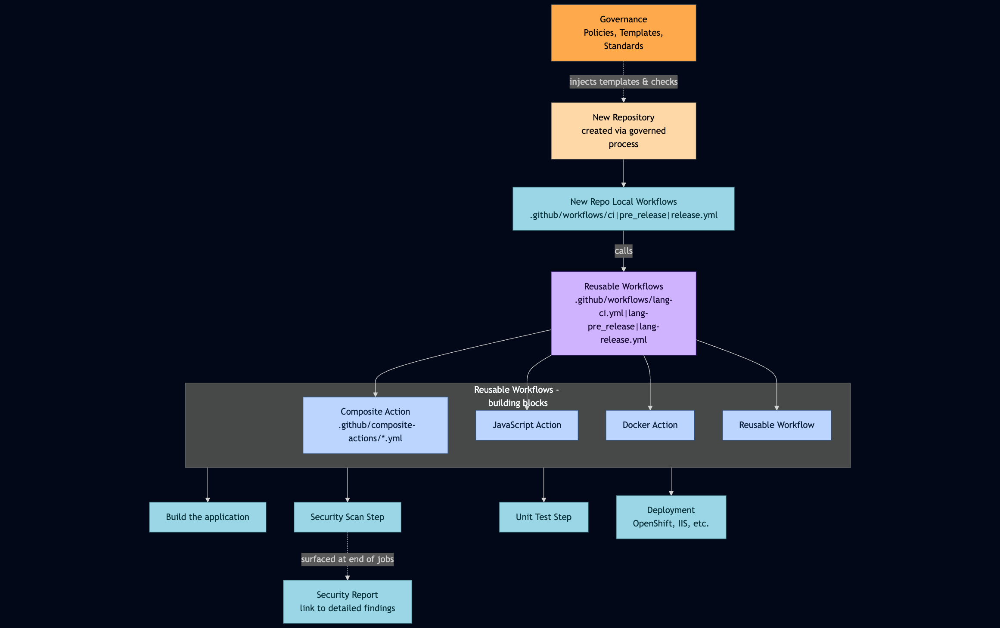

# Case Study: Availability-Focused CI/CD Migration

## Context
When I joined the team, we were more than a year behind schedule on migrating from Azure DevOps to GitHub and GitHub Actions. The delay was compounded by the fact that the team had no prior experience with GitHub Actions and lacked a clearly defined governance model. Security compliance issues were often hidden because it was difficult to see findings across pipelines in one place.

## Challenges

- Migration delay of 12+ months.

- Unfamiliarity with GitHub Actions.

- No centralized governance for workflows.

- Security test results buried in logs and difficult to track across repos.

## Options Considered

|Option|Pros|Cons|
|------|----|----|
|Migrate each repo independently|Fast per repo, team autonomy|No governance control, inconsistent practices|
|Centralized pipelines only|Consistent governance|Bottleneck in DevOps team, slower iteration
|Hybrid: local workflows + centralized reusable workflows|Governance + team autonomy|Requires upfront architecture, coding investment|

## Actions
We adopted a hybrid pipeline architecture that balanced developer autonomy with centralized governance:

- Governance baked into repo creation

- Locked repo creation to a defined process so governance templates were always included.

- Reusable workflows as the backbone

  - Each repo contained local workflows referencing centralized reusable workflows.

- Composite, JavaScript, or Docker actions were used as “functions” for repeatable small tasks.

- Security visibility at the point of use

  - Embedded security test results at the end of each job.

  - Added links to detailed security reports for easy review.

## Result

- 107% increase in OpenShift deployments after moving from manual to fully automated.

- 50% faster deployments by removing manual DevOps steps from QA processes.

- 37% increase in vulnerabilities fixed before the security team requested remediation.

- DevOps now spends 70% less time building packages, focusing on governance instead.

- Developers empowered to deploy to QA with minimal DevOps support.

## Artifacts
Overview of the workflow architecture

## Reflections
### What I learned
Moving from Azure DevOps to GitHub Actions required a mindset shift. Azure DevOps provides a standardized interface with guardrails, while GitHub Actions offers flexibility but demands upfront coding to achieve the same baseline. Assuming a tool would behave the same way without validating requirements created gaps early in the migration.

### What I’d do differently

- Define minimum pipeline governance standards before migration.

- Audit all team integrations early, prioritizing those with complex third-party dependencies.

### What’s next

- Refactor workflows to ensure standards are enforced and reduce fragile components introduced during the speed-first phase.

- Build a single pane of glass for all pipeline security findings.

- Enhance workflows to auto-generate vulnerability PRs with fixes and trigger automated tests post-generation.