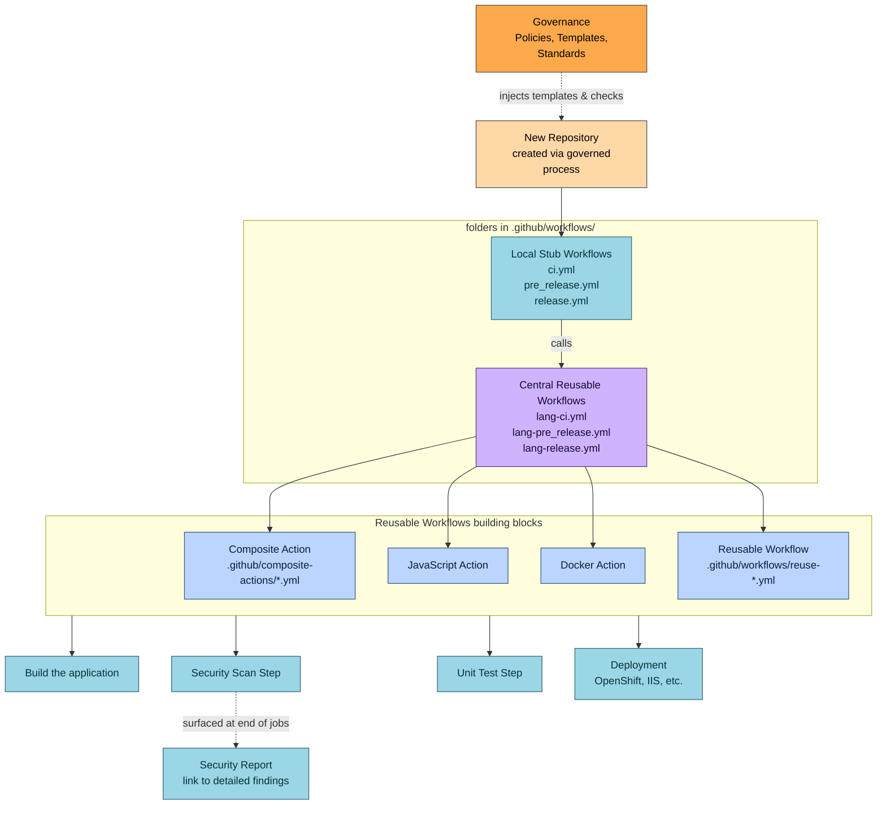

# Case Study: CI/CD Migration & Governance Platform

## Context

When I joined the team, we were more than a year behind schedule on migrating from our **Legacy CI/CD Platform** to a new **Version Control System (VCS)** and its built-in **Automation/Pipeline Tool**.

The delay was compounded by:

1. No prior experience with the new platform's workflow architecture.
2. No clearly defined policy model or governance standard for the new platform.
3. Security and compliance findings scattered across logs — no unified visibility.

---

## Challenges

- Migration delay of 12+ months with the path forward obscured by team needs and unqualified complexity.

- The migration and customer team unfamiliar with the target automation tool's architecture — building the airplane while in the air.

- No centralized governance for workflows — every team building pipelines differently.

- Security results buried in logs or reports and challenging to assess or act on consistently from build changes.

---

## Before vs. After

### Legacy Architecture (Before)

- Build pipeline lived in an older CI/CD system separate from version control.
- Security scanning was not part of the normal build — operated as a separate manual or semi-manual process.
- Results did not flow back into the main pipeline; build failures did not include security data.
- No unified metrics for failures, coverage, or vulnerabilities.
- Governance existed as tribal knowledge, not templates.
- Teams had to manually execute security steps — slow and inconsistent.

### Target Architecture (After)

- Pipelines exist natively inside the VCS platform.
- Repo creation triggers pre-approved governance templates automatically.
- All pipelines extend from centralized reusable workflows.
- Security scanning is embedded at the end of each job — visible, linked, stored consistently, part of the developer feedback loop.
- Failures include security criteria, not just build criteria.
- Policy enforcement is predictable and enforced by design, not by process.

### Highlighted Improvements

| Area | Before | After |
|------|--------|-------|
| Security scanning | Manual, separate pipeline | Embedded in every build job |
| Governance | Tribal knowledge | Templates enforced at repo creation |
| Pipeline maintenance | 200+ unique workflows | 6 central workflows |
| Security feedback | Weeks after merge | During development |
| Auditability | Inconsistent | Centralized, structured output |

---

## Options Considered

| Option | Pros | Cons |
|--------|------|------|
| Migrate each repo independently | Fast migration velocity; team autonomy | Inconsistent governance and policy controls across repos |
| Fully centralized pipelines | Consistent governance | Slow iteration; platform team becomes a bottleneck |
| **Hybrid: local stub workflows + centralized reusable workflows** | Governance + autonomy; scalable | Requires structured architecture, policy design, and coding investment |

---

## Actions

Adopted a hybrid pipeline architecture that balanced developer autonomy with centralized governance:

**Governance layer**

- Locked repo creation to a defined process so governance templates were always applied automatically.
- Policies enforced at the point of repo creation — not as a downstream review gate.

**Reusable workflow architecture backbone**

- Each repo contained a lightweight local stub workflow referencing centralized reusable workflows.
- Custom and reusable pipeline logic modules used as "functions" for repeatable complex tasks — like Lego blocks.
- 6 central workflows now power 200+ repositories — fix once, all pipelines improve.

**Security visibility at the point of use**

- Embedded security test results at the end of each job with direct links to detailed reports.
- Security criteria included in build failure conditions — not a separate manual process.

---

## Results

- **107% increase** in Container Orchestration Platform deployments after moving from manual to fully automated.
- **50% faster deployments** by removing manual DevOps steps from QA processes.
- **37% increase** in vulnerabilities fixed before the security team requested remediation.
- **70% reduction** in time DevOps spends building packages — focus shifted to governance.
- **75% reduction** in overall pipeline complexity through object-oriented workflow architecture.
- **17% reduction** in repeat deployment failures through reusable, validated components.
- **~90% security scan coverage** across the enterprise pipeline estate.
- **~25% reduction** in open vulnerability exposure through embedded DevSecOps enforcement.
- Developers empowered to deploy to QA with minimal DevOps support — no tickets, no bottlenecks.

---

## Artifacts

Architecture overview of the hybrid workflow model:

---

## Reflections

### What I learned

Moving from the legacy CI/CD platform to a modern VCS-native tool requires a mindset shift. The legacy platform provided a standardized interface with guardrails built in. The new platform offers flexibility but demands upfront architectural investment to establish a governance baseline. Assuming behavioral equivalence without validating requirements created gaps early in the migration.

### What I'd do differently

- Define minimum pipeline governance standards *before* the start of migration.

- Audit all team and repo integrations early, prioritizing those with complex third-party dependencies.

### What's next

- Refactor workflows to simplify governance audits, enable policy enforcement reviews, and reduce fragile components introduced during the speed-first phase. This can be achieved through configuration-driven pipelines and job contracts as data objects.

- Build a single pane of glass for all pipeline security findings using SBOMs and SARIF files.

- Enhance workflows to auto-generate vulnerability PRs with fixes and trigger automated tests post-generation.
